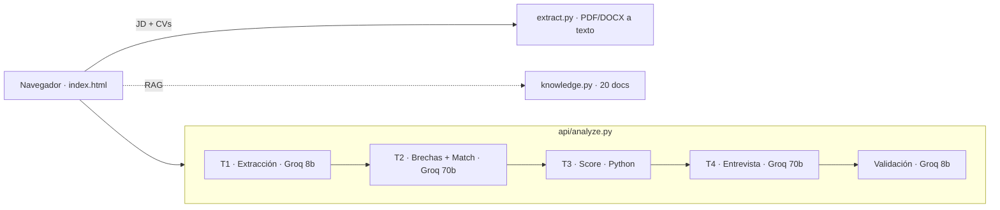

# 🧭 Asistente de Selección y Entrevistas de RRHH

> Un sistema de IA generativa que **pre-evalúa candidatos contra una descripción de puesto** — sin sacarle la decisión al reclutador.

**🔗 Demo en vivo:** https://hr-assistant-uade.vercel.app
**🛠 Stack:** JavaScript · Python (serverless en Vercel) · Groq (LLaMA)

---

## Qué es esto

Diseñé y desplegué un asistente que ayuda a un reclutador a hacer el primer filtro de CVs. El problema que quise resolver es concreto: cuando una vacante recibe decenas o cientos de postulaciones, leerlas y filtrarlas a mano consume horas, genera cuellos de botella y —por fatiga— se descartan buenos perfiles.

La idea no fue "usar ChatGPT", sino **construir un sistema integrado**: con un flujo ordenado, prompts estructurados, una base de conocimiento, evaluación de resultados y un plan de gobernanza. Lo importante para mí fue que fuera **explicable y auditable**, no una caja negra.

## Qué hace

Cargás una **descripción de puesto (JD)** y **uno o varios CVs** (PDF, DOCX o texto), y por cada candidato el sistema devuelve:

- Un **Match Score** con su justificación.
- Sus **fortalezas** (con la cita textual del CV que las respalda) y sus **brechas**.
- Una **guía de entrevista** de 4 preguntas personalizadas.
- Un **sello de validación** anti-alucinación.
- La posibilidad de **descargar el informe del candidato en PDF**.

Todo ordenado en una **tabla de candidatos** rankeada, más un panel de **RAG** que muestra qué documentos de referencia consultó.


## Cómo funciona (arquitectura)

Funciona como un **pipeline de 5 capas**. Cada capa hace una sola cosa y le pasa el resultado a la siguiente en JSON, lo que da **trazabilidad total**: cada dato del resultado se puede rastrear al texto original del CV o del JD.



El navegador orquesta 5 llamadas encadenadas por candidato; el backend (Python serverless en Vercel) arma el prompt de cada paso y le habla a Groq. **El modelo no tiene memoria**: el contexto lo mantiene mi código pasándolo de un paso al siguiente.

## Decisiones de diseño que me importan

- **El score lo calcula Python, no la IA.** Los modelos de lenguaje son inconsistentes con la aritmética (al mismo CV le pueden dar 95% una vez y 55% otra). Por eso le saqué la cuenta al modelo: la IA solo detecta las brechas, y el número final lo calcula una fórmula determinista en código. Resultado: reproducible y explicable.
- **Modelo mixto en Groq.** Uso el modelo grande (LLaMA 70b) donde importa la calidad (análisis y entrevista) y el chico (8b) para lo mecánico (extracción y validación), para optimizar costo y velocidad.
- **RAG-lite.** La base de conocimiento (20 documentos) usa recuperación léxica en vez de embeddings + base vectorial. Fue una decisión de ingeniería: correr gratis en un entorno serverless. Cumple lo importante (recuperar contexto relevante y citarlo).
- **Sin base de datos.** El sistema es *stateless*: no guarda ningún CV. Bueno para la privacidad.

## Dos cosas que aprendí iterando

**1. Una regla mal calibrada puede generar el error que buscaba evitar.**
Un candidato casi ideal daba 65% cuando debía dar ~95%. La causa: mi regla anti-alucinación ("no inferir habilidades no escritas") era tan literal que no reconocía sinónimos — el JD pedía *"estrategias de marketing"* y el CV decía *"marketing digital"*, y lo marcaba como brecha falsa. La rediseñé en dos principios (**Cero Invención** + **Cero Omisión Injustificada**) y agregué un control de validación. El mismo CV pasó a **95%**. Aprendí que el mayor riesgo de un asistente de IA no es la capacidad del modelo, sino la ambigüedad de las instrucciones.

**2. Un scoring que no escalaba.**
El score original penalizaba con un valor fijo por cada requisito faltante (−20). Funcionaba con puestos de pocos requisitos, pero con un JD real y largo se rompía: un candidato que cumplía 8 de 10 requisitos quedaba en 60% (injusto). Lo rediseñé a un **score proporcional** — mide el porcentaje de requisitos cumplidos, ponderando los excluyentes. Ahora 8 de 10 da 80% y escala igual a puestos cortos o largos.

## Gobernanza / IA responsable

- **Human-in-the-loop:** la recomendación es un insumo, nunca una decisión automática. Los scores en zona gris van a revisión manual.
- **Sin sesgos:** los prompts prohíben evaluar nombre, género, edad, nacionalidad o foto.
- **Transparencia:** cada resultado lleva su sello de validación y el score viene con cita textual y desglose.
- **Privacidad:** los CVs son datos personales (Ley 25.326); el sistema no los guarda ni reentrena el modelo con ellos.

## Stack técnico

| Capa | Tecnología |
|---|---|
| Frontend | HTML + CSS + JavaScript (una sola página, sin framework) |
| Backend | Funciones serverless en **Python** sobre **Vercel** |
| IA | **Groq** — LLaMA 3.3-70b + LLaMA 3.1-8b |
| Ingesta | pypdf + python-docx |
| RAG | Recuperación léxica sobre 20 documentos |
| Export | jsPDF (informe del candidato en el navegador) |

## Límites conocidos (honestidad ante todo)

- Lo probé con **casos representativos que construí**, no con CVs reales a gran escala.
- El RAG es léxico; para escalar a muchos rubros usaría embeddings.
- En casos borde (CVs muy pobres) la clasificación del modelo tiene algo de variabilidad — por eso el score se calcula en Python y esos casos se marcan con baja confianza y van a revisión humana.
- No tiene base de datos, login ni orquestación en backend: para producción, ese sería el siguiente paso.

## Cómo correrlo

```bash
# 1. Cloná el repo y subilo a Vercel (framework: Other)
# 2. Configurá la variable de entorno:
GROQ_API_KEY=tu_key_de_groq   # gratis en https://console.groq.com
# 3. Deploy. Vercel sirve index.html y las funciones de /api automáticamente.
```

---

*Proyecto desarrollado para la materia Inteligencia Artificial Aplicada (UADE). Lo sigo mejorando como pieza de portfolio.*
